# KSP_KOS_Scripts

Scripts for the [Kerbal Operating System (kOS)](https://ksp-kos.github.io/KOS/) mod for Kerbal Space Program.

A lot of these are works in progress. Comments are sparse, but most scripts are fairly short and named for what they do.

## Start here: `fc.ks`

`fc.ks` ("KAL 9000") is the flight-computer front end for the whole suite. Run it once per flight —

```kerboscript
run fc.
```

— and it stays in a loop: it prints a status block (situation, orbit/position, target, delta-v, next node), then shows a menu built from the ship's current `ship:status`. Picking an option dispatches to the specialist script for that job (which may prompt for its own parameters), then returns you to the menu when it's done. You never have to remember which script to run — `fc.ks` figures it out from the ship's current state.

```mermaid
flowchart TD
    Start(["run fc."]) --> Status{"ship:status"}

    Status -->|"PRELAUNCH, or LANDED at Kerbin"| Launch["Launch menu"]
    Status -->|"LANDED / SPLASHED elsewhere"| Surface["Surface menu"]
    Status -->|"ORBITING / ESCAPING / SUB_ORBITAL"| Space["Space menu"]
    Status -->|"FLYING (in atmosphere)"| Air["Air menu"]

    Launch --> rlseq1["rlseq.ks (quick or prompted)"]
    Launch --> ssto1["ssto.ks (quick or prompted)"]
    Launch --> launchwindow1["launchwindow.ks"]
    Launch --> plane_launch1["plane_launch.ks"]
    Launch --> science1["science.ks"]

    Surface --> hop1["hop.ks"]
    Surface --> science2["science.ks"]
    Surface --> rlseq2["rlseq.ks"]
    Surface --> launchwindow2["launchwindow.ks"]
    Surface --> basedock["basedock.ks"]
    Surface --> rove["rove.ks"]
    Surface --> hover["hover.ks"]

    Space --> Maneuver["Maneuver planning..."]
    Space --> node["node.ks (execute next node)"]
    Space --> Prox["Proximity ops..."]
    Space --> Land["Land..."]
    Space --> science3["science.ks"]
    Space --> timewarp["timewarp.ks"]

    Maneuver --> hohmann["hohmann.ks"]
    Maneuver --> interplanet["interplanet.ks"]
    Maneuver --> matchplanes["matchplanes.ks"]
    Maneuver --> capture["capture.ks"]
    Maneuver --> circat["circat.ks + node.ks (circularize)"]
    Maneuver --> node_tune["node_tune.ks"]
    Maneuver --> change_alt["change_alt.ks"]
    Maneuver --> planeland1["planeland.ks (deorbit + autoland)"]

    Prox --> rendezvous["rendezvous.ks"]
    Prox --> dock["dock.ks"]
    Prox --> grapple["grapple.ks"]
    Prox --> transfer_fuel["transfer_fuel.ks"]

    Land --> landat["landat.ks"]
    Land --> hop2["hop.ks"]

    Air --> planeland2["planeland.ks"]
    Air --> plane_launch2["plane_launch.ks"]
    Air --> science4["science.ks"]
```



### Menu options by situation

**Prelaunch, or landed at Kerbin** — launch menu:
- QUICK rocket launch / QUICK SSTO launch — `rlseq.ks` / `ssto.ks` with sane defaults, no prompts
- Rocket launch with prompts — `rlseq.ks`
- SSTO launch with prompts — `ssto.ks`
- Timed launch to meet a target — `launchwindow.ks`
- Plane takeoff + cruise — `plane_launch.ks`
- Science sweep — `science.ks`

**Landed or splashed elsewhere** — surface menu:
- Hop to another site — `hop.ks`
- Science sweep — `science.ks`
- Ascend to orbit — `rlseq.ks`
- Timed launch to meet a target — `launchwindow.ks`
- Hover-dock with a base port — `basedock.ks`
- Rover cruise / drive to waypoint — `rove.ks`
- Hover (altitude hold) — `hover.ks`

**Orbiting, escaping, or sub-orbital** — space menu:
- Plan a maneuver → **maneuver planning submenu**: `hohmann.ks`, `interplanet.ks`, `matchplanes.ks`, `capture.ks`, circularize (`circat.ks` + `node.ks`), `node_tune.ks`, `change_alt.ks`, `planeland.ks` (spaceplane deorbit)
- Execute next node — `node.ks`
- Proximity ops → **submenu**: `rendezvous.ks`, `dock.ks`, `grapple.ks`, `transfer_fuel.ks`
- Land → **submenu**: `landat.ks` (next to a base), `hop.ks` (under current position)
- Science sweep — `science.ks`
- Warp to... — `timewarp.ks`

**Flying in atmosphere** — air menu:
- Autoland at KSC runway — `planeland.ks`
- Cruise autopilot — `plane_launch.ks`
- Science sweep — `science.ks`

## Repository layout

- Top-level `.ks` files — the active scripts listed above, plus flight-control utilities (`antenna.ks`, `deploy_fairings.ks`, `status.ks`, `incseq.ks`, etc.)
- `lib_*.ks` — shared libraries (orbit math, Lambert solver, staging, input handling, UI, physics)
- `boot/` — boot scripts loaded on vessel startup
- `attic/` — deprecated or superseded scripts kept for reference
- `*_log.csv` — flight/mission logs written by the corresponding scripts
- `docs/kos/` — offline mirror of the [kOS documentation](https://ksp-kos.github.io/KOS/) for local reference; see [docs/kos/README.md](docs/kos/README.md)

## Notes

- This repo uses `main` as the default branch

## Script reference

### Top-level (`Script/`)

- `antenna.ks` — toggles/extends/retracts all deployable antennas on the ship; `parameter dowhat` accepts `"extend"`, `"retract"`, or `"toggle"` (default).
- `basedock.ks` — hover-docks a rocket onto a surface base's docking port, auto-detecting SIDE (radial port, slide in) or TOP (bottom port, land on it) geometry; AG9 aborts to a gentle landing.
- `capture.ks` — adds a retrograde capture node at next periapsis to brake into an elliptical orbit; `parameter tgt_ap` (apoapsis altitude, default interactive "ask").
- `change_alt.ks` — adds a Hohmann node to raise/lower orbital altitude to `parameter target_alt`, optionally executes and circularizes.
- `circat.ks` — adds a circularization maneuver node at apoapsis or periapsis via `parameter choice` (`"ap"`/`"pe"`, default `"ap"`); note: internal header calls it `circ_at.ks` though the file is `circat.ks`.
- `deploy_fairings.ks` — deploys all procedural fairings on the ship (no parameters); simple one-shot action script.
- `dock.ks` — automated docking system v2: picks free ports on ship and target, flies to the approach axis, and closes in; `parameter debug` (default true) draws guidance vectors; controls AG9 abort, HOME/END roll, UP/DOWN speed scale.
- `fc.ks` — "KAL 9000" flight-computer menu front end that dispatches to all the other mission scripts based on current ship situation; run and stay in a loop until exit; no parameters.
- `flightlog.ks` — library-style helper that appends launch stats to `0:/flightlog.csv`; exposes `log_flight(dv_used, elapsed, ltwr, mtwr)`, meant to be imported via `runoncepath`, not run directly.
- `grapple.ks` — approaches and grabs the target with a Klaw (Advanced Grabbing Unit), arming it and retrying missed grabs; AG9 abort, AG10 rolls 15°; no parameters.
- `hohmann.ks` — computes a Hohmann transfer node to another body/vessel around the same parent body; `parameter sep_offset` (pass offset in meters, or "ask" for interactive menu).
- `hop.ks` — vacuum-world lander/hopper (built for Gilly): lands from orbit, or does ballistic 45° hops between biomes; `parameter hd` (heading), `parameter dist` (distance).
- `hover.ks` — altitude-hold hover controller with drift cancellation; `parameter seekalt` (target radar altitude); PGUP/PGDN/UP/DOWN adjust altitude, HOME/DELETE/AG9 land and exit.
- `incseq.ks` — launches inclined to match a target's ascending/descending node, then circularizes and executes the node; `parameter Ap` (apoapsis); chains rocket_launch.ks, circat.ks, node.ks.
- `interplanet.ks` — full interplanetary transfer planner using a Lambert-solver porkchop search, builds and self-refines the ejection node against real patched conics; no required parameters (menu-driven target pick).
- `landat.ks` — precision landing beside a landed vessel/base on an airless body; `parameter standoff` (distance from base in meters).
- `launchwindow.ks` — times a launch from the pad/base so apoapsis arrival coincides with a target vessel passing overhead; `parameter t_asc` (ascent time to apoapsis), `parameter downrange` (deg).
- `lib_input.ks` — LIBRARY: terminal input helpers; exposes `read_number(prompt, default, row)` and `read_menu(title, options, row)`; import via `runoncepath`, not run directly.
- `lib_lambert.ks` — LIBRARY: universal-variables Lambert solver (Bate-Mueller-White); exposes `lambert(r1v, r2v, tof, mu, hdir)` returning transfer velocities; import only.
- `lib_orbit.ks` — LIBRARY: analytic Kepler propagation for vessels (works around `positionat` frame-mixing bugs for far-future vessel predictions); exposes `relpos_at`, `orbit_relpos_at`, `orbit_frame_cal`, `kepler_r_nu`; import only.
- `lib_physics.ks` — LIBRARY: general physics helpers; exposes `weight`, `g_here`, `fg_here`, `ship_twr`, `grav_standard`, `stand_grav_param`, `find_ship_bottom`, `find_ship_length`, `time_to_impact`; import (or `run`) only, not meant to run standalone for a mission.
- `lib_staging.ks` — LIBRARY: shared autostaging safety logic; exposes `stage_needed()`, `next_stage_ignites()`, `safe_to_stage(floor)` (refuses to stage payload-only separations); import only.
- `lib_ui.ks` — LIBRARY: terminal UI helpers for a consistent look; exposes `ui_header`, `ui_kv`, `ui_bar`, `ui_time`; import only.
- `matchplanes.ks` — matches orbital plane with a target (vessel/body) or a contract-specified inclination/LAN, creates and can execute the plane-change node; `parameter c_inc`, `parameter c_lan` (skip target mode, contract inc/LAN).
- `node.ks` — executes the next maneuver node with autostaging, battery-aware warp, and alignment safety checks; no parameters (operates on `nextnode`).
- `node_tune.ks` — fine-tunes an existing node's prograde dv to hit a desired encounter periapsis; `parameter tgt_periapsis`, `parameter dv_step` (default 0.01).
- `petal.ks` — self-contained, dependency-free Gilly lander kit (hop/science/land-from-orbit) sized to fit a small kOS disk; no parameters, keypress menu (1/2/3).
- `plane_launch.ks` — jet aircraft takeoff + cruise autopilot (engine-agnostic); `parameter cruise_alt`, `parameter cruise_hd` (default 90), `parameter cruise_spd` (default 180), `parameter vr` (rotation speed, default 50).
- `planeland.ks` — automatic landing on the KSC runway 09, including experimental deorbit/reentry handling for spaceplanes starting in orbit; no parameters; AG9 aborts.
- `rendezvous.ks` — full automatic rendezvous with another vessel (plane match, Hohmann transfer, braking, creep-in); `parameter stop_dist` (default interactive "ask", stop distance in meters).
- `rlseq.ks` — rocket launch sequence chaining rocket_launch.ks, circat.ks, and node.ks then logs the flight; `parameter Ap`, `parameter tgt_hd` (default 90), `parameter liftofftwr` (1.45), `parameter maxtwr` (2.20), `parameter stopstage` (0).
- `rocket_launch.ks` — adaptive gravity-turn ascent guidance script; `parameter tgt_ap`, `parameter tgt_hd` (90), `parameter liftofftwr` (1.45), `parameter maxtwr` (2.20), `parameter stopstage` (0).
- `rove.ks` — rover cruise autopilot holding speed/heading or driving to a waypoint; `parameter tspeed`, `parameter thead` (-1 = hold current), `parameter wname` (waypoint name).
- `science.ks` — runs all onboard science experiments once and transmits/stores based on a value threshold; `parameter transmit_frac` (default interactive "ask").
- `ssto.ks` — single-stage-to-orbit ascent autopilot for RAPIER spaceplanes (airbreathing climb, mode-switch, rocket climb, circularize); `parameter tgt_ap`, `parameter hd` (90), `parameter run_alt` (12000), `parameter vr` (80), `parameter rocket_pitch` (35).
- `status.ks` — continuous flight-data HUD (roll/pitch/AoA/sideslip/glideslope, orbit period, target distance/relative speed); no parameters, runs an infinite display loop.
- `timewarp.ks` — interactive warp-to menu (node minus margin, apoapsis, periapsis, SOI transition, or custom seconds); no parameters.
- `transfer_fuel.ks` — menu-driven resource transfer between docked vessel elements; no parameters (must be run while docked).

### `boot/`

- `boot.ks` — kOS CPU boot script; syncs library/script tiers from the archive to local disk by priority (for comms-loss resilience), cancels any warp left running after a reboot, and prints a "run fc." hint; no parameters.

### `attic/` (deprecated/old versions)

- `dock_deprecated.ks` — older manual-ish docking script (keypad-controlled offset/rotation/speed with a fixed local port name); superseded by the top-level `dock.ks` auto-docking system.
- `interplanet_2.ks` — an earlier interplanetary Hohmann-transfer-node calculator (phase-angle based, in-plane only); superseded by the Lambert-solver `interplanet.ks`.
- `interplanet_old.ks` — an earlier/alternate interplanetary transfer calculator (ejection velocity/angle formulas, phase-angle wait-time); superseded by `interplanet.ks`.
- `killz.ks` (file `killz.ks`, header says `killhorz.ks`) — old script to kill horizontal velocity while holding near-zero vertical speed during a landing approach, using a pitch PID.
- `land.ks` — old landing-node script that lowers periapsis to terrain height then raises it iteratively until the predicted orbit clears all terrain obstacles.
- `launch_seq.ks` — old spaceplane (Aeres) launch sequence chaining `plane_launch.ks`, `circ_at.ks`, and `node.ks`; superseded by current launch sequence scripts.
- `lib_ship_steering.ks` — old tiny library exposing a single `compute_heading(vecT)` helper function; superseded/unused by current libs.
- `plane_launch_old.ks` — old Rapier-specific spaceplane launch autopilot (fixed pitch schedule, AG1/AG2 mode switches); superseded by the current `plane_launch.ks`.
- `s2l.ks` — old "surface to launch"/phasing script that computes a wait time to launch and rendezvous with a target based on orbital period and longitude math, then chains into itself/relaunch; predecessor to `launchwindow.ks`.
- `s2lint.ks` — old adaptive-pitch rocket ascent script with a target apoapsis/heading and a state-machine-based pitch program; predecessor to `rocket_launch.ks`.
- `slam.ks` — old "hoverslam" suicide-burn landing script computing burn start from predicted impact time vs. stop time; superseded by newer landing scripts (`hop.ks`/`landat.ks`).
- `slamhov.ks` — old hoverslam variant that hands off to `hover.ks` once near the surface instead of landing outright; superseded by newer landing/hover scripts.
